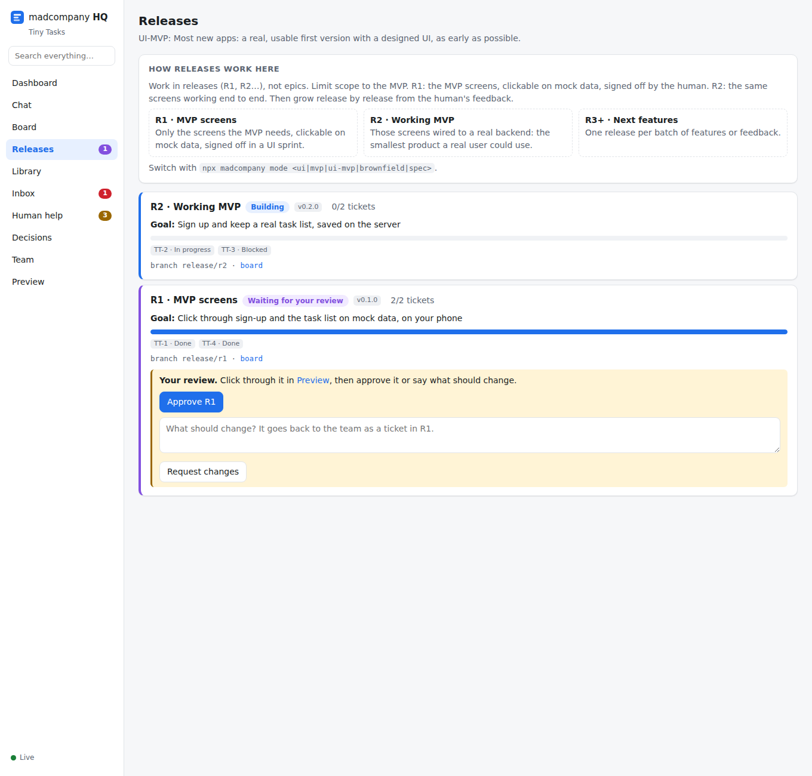
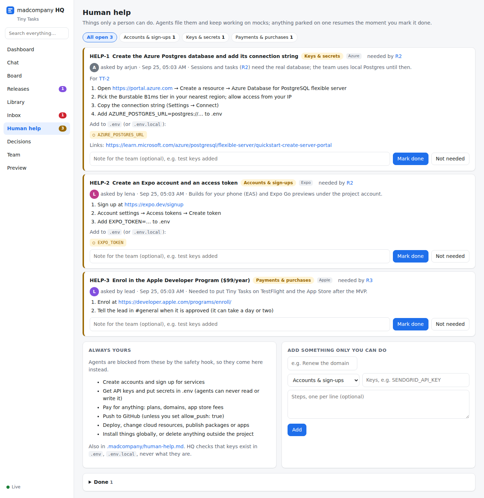

# madcompany

**An AI software company inside your own Claude Code session.** A team of agents with roles, memory and a model you choose builds your app in parallel: screens first, release by release. You follow every message, ticket and decision in **HQ**, a local app with a dashboard, Teams-style chat, a Jira-style board, releases, a library and your inbox. You only step in where a person has to.

**[Website](https://lokkrish.github.io/madcompany/)** · [Workflows](https://lokkrish.github.io/madcompany/workflows.html) · [Human help](https://lokkrish.github.io/madcompany/human-help.html) · [Commands](https://lokkrish.github.io/madcompany/commands.html) · [Usage guide](docs/USAGE.md) · [Spec](docs/SPEC.md)

Compatible with [BMad Method](https://github.com/bmad-code-org/BMAD-METHOD) v6. Not affiliated with BMad Code, LLC.


## Why

BMad plans well, but its build phase goes one story at a time (create story → develop → review → next), about two weeks per epic, and you can't see the app until late. madcompany replaces that loop with a team:

- **Parallel work.** Agents with roles (backend, web, mobile, QA, security…) take tickets in their own domain, each in its own git worktree, with its own ports and database.
- **You see it early.** Screens come first on mock data; click through them in HQ's Preview and comment on any element.
- **You're asked only what's yours.** One-line, multiple-choice questions with a recommendation. Answers are saved, so nobody asks twice.
- **Everything only you can do is in one list:** [Human help](#human-help). Accounts, API keys, payments, pushes and deploys, each with exact steps.
- **Every reference is clickable.** FR12, Story 1.2, APP-42, DEC-7, HELP-3, R2: click it and HQ opens the exact line.
- **Staffed like a company.** 14 roles in 7 departments, templates for 5, 10 or 20 people, a model per agent, and teammates or clients can sign in to HQ.

## Five ways to build

Pick one per project with `npx madcompany init --mode <mode>`; switch any time with `npx madcompany mode <mode>`. Four of them deliver **release by release**: something you can see or use at the end of each one.

| Mode | For | You plan with | Delivers | First delivery |
|---|---|---|---|---|
| [`ui`](https://lokkrish.github.io/madcompany/ui-driven.html) UI-driven | Apps where the screens are the product | Brief + UX | Releases | Clickable prototype of every key screen |
| [`mvp`](https://lokkrish.github.io/madcompany/mvp-driven.html) MVP-driven | APIs, CLIs, bots, pipelines; smallest working thing first | Brief + MVP scope | Releases | The thinnest slice that works end to end |
| [`ui-mvp`](https://lokkrish.github.io/madcompany/ui-mvp.html) UI-MVP (default) | Most new apps | Brief + MVP scope + UX for those screens | Releases | The MVP screens, clickable; then the working MVP |
| [`brownfield`](https://lokkrish.github.io/madcompany/brownfield.html) | An existing codebase | A codebase scan | Releases | Onboarding + a first small change |
| [`spec`](https://lokkrish.github.io/madcompany/spec-driven.html) Spec-driven | Large or regulated products | Full BMad: PRD, architecture, epics | Epics | Epic 1 |

## Quick start

Needs Node 20+, git and Claude Code. macOS and Linux; Windows through WSL.

```bash
# in your app's repo
npx madcompany init --mode ui-mvp   # or ui, mvp, brownfield, spec
npx madcompany hq                   # keep it running; open http://127.0.0.1:4317
npx madcompany mode                 # prints the steps for your mode
claude                              # accept the trust prompt once, then follow the steps below
```

Or install it as a BMad module: `npx bmad-method install --custom-source https://github.com/lokkrish/madcompany --tools claude-code`, then run `/mc-setup`.

**Just looking?** `npx madcompany demo my-demo && cd my-demo && npx madcompany hq` builds a sample project mid-way through a UI-MVP build.

## Workflows and commands

Lines starting with `/` run in Claude Code; `npx` lines run in a terminal. `/mc-staff` needs one restart of Claude Code afterwards so the new agents load.

### UI-driven: the whole UI first, then the logic behind it

```text
npx madcompany init --mode ui
/bmad-product-brief          what the product is and who it's for
/bmad-ux                     the UX vision and the screens
/mc-staff                    pick the team
/mc-plan-release             R1: the clickable prototype, every key screen on mock data
/mc-ui-sprint                click through it in HQ → Preview, comment, sign off
/mc-start                    the team builds; you answer Inbox and Human help
HQ → Releases → Approve      or Request changes
npx madcompany ship R1       merge into main + tag; push and deploy are in Human help
/mc-plan-release             R2 working core flows, R3… from your feedback
```

### MVP-driven: the thinnest working slice first

```text
npx madcompany init --mode mvp
/bmad-product-brief          the problem and the one job the MVP must do
/bmad-spec                   optional: a short MVP scope
/mc-staff
/mc-plan-release             R1: the MVP, end to end on mocked integrations
/mc-start
HQ → Releases → Approve      try it via Swagger UI or the CLI demo first
npx madcompany ship R1
HQ → Human help              add the real service keys
/mc-plan-release             R2 real integrations, R3… features from your feedback
```

### UI-MVP: MVP screens signed off, then the working MVP

```text
npx madcompany init --mode ui-mvp
/bmad-product-brief
/bmad-spec                   the MVP scope: the smallest set of features worth using
/bmad-ux                     UX for the MVP screens only
/mc-staff
/mc-plan-release             R1: the MVP screens, clickable on mock data
/mc-ui-sprint                sign them off
/mc-start                    build R1 → approve → npx madcompany ship R1
/mc-plan-release             R2: the same screens on a real backend
/mc-start                    build R2 → approve → ship; then R3… from your feedback
```

### Brownfield: an app that already exists

```text
npx madcompany init --mode brownfield
/mc-scan                     map the codebase: stack, modules, commands, conventions, owners, services
/mc-staff                    domains follow the codebase map
HQ → Inbox → Request a change    or just tell the lead what to change or fix
/mc-plan-release             R1: onboarding + a first small change set
/mc-ui-sprint                only if the change is visible
/mc-start
HQ → Releases → Approve
npx madcompany ship R1
```

### Spec-driven: full BMad planning, epic by epic

```text
npx madcompany init --mode spec
/bmad-product-brief → /bmad-prd → /bmad-ux → /bmad-architecture → /bmad-create-epics-and-stories
/mc-staff
/mc-plan-epic                import the stories as tickets, anchor every requirement ID
/mc-ui-sprint                for epics with screens
/mc-start                    approve the epic in HQ → Epics
npx madcompany ship E1
```

BMad skill names are from its current docs; if one differs in your version, `/bmad-help` lists them.

### How a release runs

**Planned** → **Building** → **your review** → **approved** → **shipped**. The lead proposes one release with a goal you can see or do at the end of it, and you confirm it. The team builds it, and every ticket is reviewed by someone other than its author and merged into `release/rN` through a queue that re-runs your checks. When all of it is merged, HQ → Releases asks you to **Approve** or **Request changes** (which go back as a ticket in the same release). `npx madcompany ship R1` merges the approved release into `main`, tags it and writes release notes. Pushing and deploying stay yours.



## Human help

Some things only a person can do: sign up for a service, create an API key, pay, push, deploy. Agents are blocked from those, so they file them in **HQ → Human help** with numbered steps, links and the `.env` key names, and keep building on mocks. HQ shows which keys are in your `.env` (it checks the names, never reads the values). When you mark an item done, anything parked on it resumes. Planning files them early, so you can do them while the team works, and `ship` adds "Push and deploy R1" with the exact commands and your own `deploy:` steps.



## What you get

| In Claude Code | What it does |
|---|---|
| `/mc-setup` | After installing as a BMad module: asks your mode and sets up the project |
| `/mc-staff` | Roles, domains and models for your app (or a 5/10/20-person template); one subagent per member |
| `/mc-scan` | Brownfield: map the codebase, set the real checks, file Human help for missing keys |
| `/mc-plan-release` | Plan the next release with you: one goal, single-domain tickets, Human help filed early |
| `/mc-plan-epic` | Spec-driven: import BMad stories, anchor IDs, split into tickets |
| `/mc-ui-sprint` | Build and sign off screens with you; derive the API contract |
| `/mc-start` | Start the workday; your session becomes the lead |
| `/mc-minutes` | Minutes of the current conversation (key points, decisions, actions, links) into HQ |
| `/mc-end-day`, `/mc-stop` | End the day with handoffs, or stop immediately |

| CLI (`npx madcompany …`) | What it does |
|---|---|
| `init [--mode M]`, `mode [M]` | Set up; show or switch how the project is built |
| `hq [--share]` | HQ and the MCP server agents use. `--share` lets your team sign in from their own machines |
| `staff [--template small\|medium\|large]` | Generate the agents; or start from a 5, 10 or 20-person company |
| `people add\|link\|remove\|list` | Invite teammates (member) or clients (viewer) to HQ |
| `scan` | Look at an existing codebase: stack, checks, services, env keys |
| `import` | Anchor BMad docs and import stories as tickets |
| `merge <ticket>` | Merge queue: merge into the release or epic branch, run checks, then mark done or revert and reopen |
| `ship <R1\|E1>` | Merge an approved release or epic into main and tag it; push and deploy go to Human help |
| `refs check` / `refs fix` | Find or fix bare references like "FR12" that should be links |
| `status`, `env <agent>`, `snapshot` | Summary, per-agent ports and database, commit HQ's logs |

HQ's screens: **Dashboard, Chat, Board, Releases, Library, Inbox, Human help, Decisions, Team, Preview**, plus search. Full reference: [Commands](https://lokkrish.github.io/madcompany/commands.html).

## Safety

Agents work unattended, so the rules are enforced in code, not just in prompts:

- A **pre-tool hook** blocks pushing, force-pushing, deploys, cloud changes, publishing, global installs, piping downloads into a shell, deleting outside the project, and reading or writing `.env` secrets. Those go to you in Human help.
- **HQ** listens on 127.0.0.1 only and rejects cross-origin and foreign-host requests. With `hq --share`, everyone signs in with a personal link (stored hashed, revocable), and agents and the CLI still only talk to HQ from your machine.
- **Agents** never see your Claude credentials: they run inside your own Claude Code session on its login.
- **No third-party skill marketplace.** Third-party services run on mocks until you add real keys yourself.

## Status

v0. Covered by 54 automated tests. The core loop was checked with real Claude Code runs (a Sonnet lead with Haiku dev and QA agents):

| Run | What happened | Time | Usage |
|---|---|---|---|
| Plain ticket | dev built it → QA reviewed and ran the tests → merged → End day handled | 2–2.5 min | ~$0.5 |
| Park and resume | dev hit an unspecified product decision → asked → parked with a checkpoint → lead escalated it to you as multiple-choice → you answered (saved as a fact) → dev resumed → reviewed → merged | ~2.5 min | ~$0.7 |

Releases, modes and Human help are covered by automated tests but haven't had a real Claude Code run yet. Not yet built: a deploy step beyond the Human help checklist, importing in-progress BMad sprints, screenshot comparison, a Codex adapter. See [docs/SPEC.md §17](docs/SPEC.md#17-build-v0) and the [roadmap](docs/SPEC.md#19-roadmap-what-a-20-person-company-still-does-that-this-doesnt).

## License

MIT. BMad and BMad Method are trademarks of BMad Code, LLC; madcompany is an independent project that works with it.
