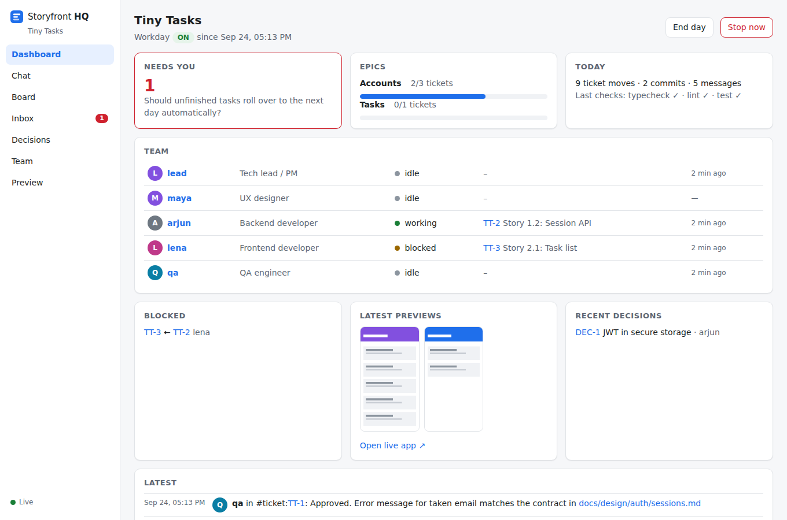
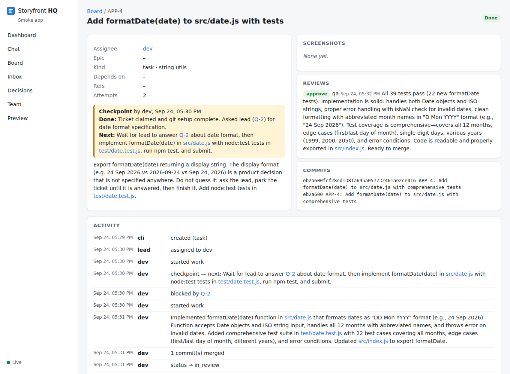

# madcompany

**A UI-first AI dev team that runs inside your own Claude Code session.** You plan with [BMad Method](https://github.com/bmad-code-org/BMAD-METHOD) as usual. Then, instead of looping create-story → dev-story → review one story at a time, a team of agents builds the whole epic in parallel. You follow them in **HQ**, a local app with a dashboard, Teams-style chat, a Jira-style board, a decisions log and your inbox.

Compatible with BMad Method v6. Not affiliated with BMad Code, LLC.



## Why

- **You're only needed where it matters:** the UI sessions, real decisions, and the end-of-epic demo. Everything else runs without you.
- **You see the app as it's built.** Screens come first, on mock data; screenshots land on every UI ticket.
- **No walls of text.** Questions reach you as one-line, multiple-choice items with a recommended answer, and your answers are saved so nobody asks twice.
- **Every reference is clickable.** FR12, Story 1.2, APP-42, DEC-7: click it and HQ opens the exact line.
- **Agents have roles, memory and a model you choose.** Each has a domain, a work memory and a comms memory, plus its own git worktree, ports and database. Pick Opus, Sonnet or Haiku per agent from HQ's Team page.

## How it works

1. **Plan** with BMad (brief, PRD, architecture, UX, epics). Nothing changes here.
2. **Staff** the team: `/mc-staff` proposes roles and domains for your app; you decide how many.
3. **Plan the epic:** `/mc-plan-epic` anchors every ID in your BMad docs and turns stories into single-domain tickets with dependencies.
4. **UI sprint** (you + the UX agent): clickable screens with fake data. Comment on any element in Preview, and each comment becomes a ticket. Sign-off locks the screens and produces the API contract.
5. **Build:** `/mc-start` makes your Claude Code session the lead. It keeps up to `max_parallel` agents busy, parks blocked work (checkpoint, then resume when unblocked), gets every ticket reviewed by someone other than its author, and merges through a queue that re-runs your checks.
6. **Workday:** End day makes everyone hand off; Stop now blocks every agent's next action. Tomorrow, `/mc-start` picks up from the handoffs.
7. **Demo:** you click through the epic, then the epic branch goes to main.

Details: [docs/USAGE.md](docs/USAGE.md). Design and requirements: [docs/SPEC.md](docs/SPEC.md).

## Quick start

Needs Node 20+, git and Claude Code. macOS and Linux; Windows through WSL.

```bash
# in your app's repo (after BMad planning)
npx madcompany init          # .madcompany/, .mcp.json, safety hook, /mc-* skills
npx madcompany hq            # keep running; open http://127.0.0.1:4317
claude                       # accept the trust prompt once, then:
/mc-staff                    # pick the team (then restart Claude Code once)
/mc-plan-epic                # BMad epics → tickets
/mc-ui-sprint                # screens with you
/mc-start                    # the team works; you watch HQ
```

Or install it as a BMad module: `npx bmad-method install --custom-source https://github.com/lokkrish/BMAD-company --tools claude-code`, then run `/mc-setup`.

**Just looking?** `npx madcompany demo my-demo && cd my-demo && npx madcompany hq` builds a sample project with a day of simulated team activity.

## What you get

| In Claude Code | What it does |
|---|---|
| `/mc-staff` | Choose roles, domains and models, then generate one subagent per member |
| `/mc-plan-epic` | Import BMad stories, anchor IDs, split into tickets |
| `/mc-ui-sprint` | Build and sign off screens with you; derive the API contract |
| `/mc-start` | Start the workday; your session becomes the lead |
| `/mc-end-day`, `/mc-stop` | End the day with handoffs, or stop immediately |

| CLI (`npx madcompany …`) | What it does |
|---|---|
| `hq` | The HQ app and the MCP server agents use |
| `import` | Anchor BMad docs and import stories as tickets |
| `merge <ticket>` | Merge queue: merge into the epic branch, run checks, then mark done or revert and reopen |
| `refs check` / `refs fix` | Find or fix bare references like "FR12" that should be links |
| `status`, `env <agent>`, `snapshot` | Summary, per-agent ports and database, commit HQ's logs |

## Safety

Agents work unattended, so the rules are enforced in code, not just in prompts:

- A **pre-tool hook** blocks pushing, force-pushing, deploys, cloud changes, publishing, global installs, piping downloads into a shell, deleting outside the project, and reading or writing `.env` secrets. Those always go to you.
- **HQ** listens on 127.0.0.1 only and rejects cross-origin and foreign-host requests.
- **Agents** never see your Claude credentials: they run inside your own Claude Code session on its login.
- **No third-party skill marketplace.** Third-party services run on mocks until you add real keys yourself.

## Status

v0. The core loop is covered by 34 automated tests and was checked with real Claude Code runs: a Sonnet lead with Haiku dev and QA agents.

| Run | What happened | Time | Usage |
|---|---|---|---|
| Plain ticket | dev built it → QA reviewed and ran the tests → merged → End day handled | 2–2.5 min | ~$0.5 |
| Park and resume | dev hit an unspecified product decision → asked → parked with a checkpoint → lead escalated it to you as multiple-choice → you answered (saved as a fact) → dev resumed → reviewed → merged | ~2.5 min | ~$0.7 |



Not yet: deploy after the demo, importing in-progress BMad sprints, screenshot comparison, and a Codex adapter. See [docs/SPEC.md §17](docs/SPEC.md#17-build-v0).

## License

MIT. BMad and BMad Method are trademarks of BMad Code, LLC; madcompany is an independent project that works with it.
