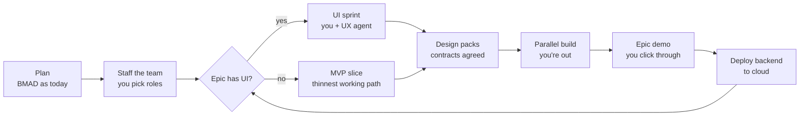
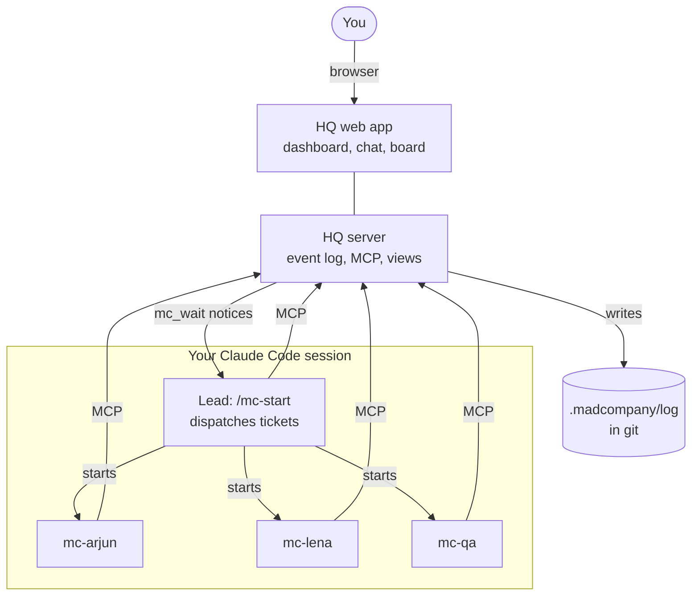

# madcompany: Spec

**Status:** v0.3, 2026-09-24. v0 is built; see [§17](#17-build-v0) for what's in it and what's next.
**Name:** madcompany (earlier: "BMAD Company", then "Storyfront"; see [OSS-1](#oss-1)).
**How to read IDs:** every ID in this file is a link. Click it to jump to its definition. New IDs are added at the end of their section; existing IDs are never renumbered.

## TL;DR

- Keep BMAD for planning. Replace its story-by-story build loop with a team of AI agents working in parallel.
- You're involved in three places: UI/UX sessions, escalations the team can't resolve, and the end-of-epic demo.
- Everything the team does is visible in **HQ**, a local app combining Teams-style chat, a Jira-style board, a decisions log and a dashboard.
- Every reference (requirement, ticket, decision, file) is a clickable link.
- The team runs inside your own Claude Code session, on your machine, during a workday you start and end.
- Open source, installable as a BMad module or on its own.

## 1. Problems this solves

| BMAD Phase 4 today | Fix in this spec |
|---|---|
| Create → dev → review loop per story, gated by you; about 2 weeks per epic | Parallel team; you're not in the per-story loop ([TKT-1](#tkt-1)) |
| Nothing to see until late; course-correct after weeks | UI first, continuous preview ([VIS-1](#vis-1)) |
| Long walls of text to read | Dashboard and one-line, multiple-choice escalations ([HQ-1](#hq-1), [ESC-4](#esc-4)) |
| The same questions asked again | A register of your answers that agents check before asking ([ESC-3](#esc-3)) |
| References like "FR-12" that you can't click | Every reference is a link ([REF-1](#ref-1)) |
| Blocked work wastes usage while waiting | Park and resume ([TKT-3](#tkt-3)) |

## 2. Decisions already made

| ID | Decision |
|---|---|
| <a id="d1"></a>D1 | The team runs inside the user's own Claude Code session (Codex later, [OSS-7](#oss-7)). HQ is reachable over MCP and plain files, so either host can use it. |
| <a id="d2"></a>D2 | The app stack is chosen per project during planning. Shortlist: Next.js, Expo / React Native, Postgres; hosting on Vercel, Azure or AWS. |
| <a id="d3"></a>D3 | Runs on your machine, with a workday you start and end ([DAY-1](#day-1)). |
| <a id="d4"></a>D4 | Escalations reach you only in HQ. No phone, Slack or Teams pings. |
| <a id="d5"></a>D5 | Agents use the host's own login, whatever the user has set up (Claude plan or API key). The product never handles credentials ([SEC-5](#sec-5)). |
| <a id="d6"></a>D6 | Each agent has a role plus domain expertise defined per app. They mostly stay in their domain but aren't locked to a single skill. |
| <a id="d7"></a>D7 | The board is built into HQ, not synced to Jira or GitHub Issues. |
| <a id="d8"></a>D8 | Agents are persistent in the style of OpenClaw, minus its public skill marketplace and public exposure. |
| <a id="d9"></a>D9 | BMAD stays for planning. This replaces BMAD's Phase 4 (implementation). |
| <a id="d10"></a>D10 | The project is public and open source ([§16](#16-open-source)). |
| <a id="d11"></a>D11 | v0 supports macOS and Linux; Windows through WSL. |

## 3. How a project runs



| Step | Who | You involved? | Output |
|---|---|---|---|
| Plan | BMAD agents (analyst, PM, architect, UX) | Yes, as in BMAD today | PRD, architecture and epics, with linkable IDs |
| Staff | Lead + you | Yes: pick the roster | `team.yaml` and an identity file per agent |
| UI sprint (per epic) | UX + frontend + you | Yes: your main session | Clickable prototype with fake data |
| MVP slice (epics without UI) | Team | Review the result | A working thin path, shown in an API explorer or a CLI run |
| Design packs | Developers | No | Sketches, contracts and schema: draft → agreed → frozen |
| Build | Whole team, in parallel | Only for escalations | Merged tickets and previews |
| Epic demo | You | Yes | Go, or a change list |
| Deploy | Devops agent | Approve | Backend running in the cloud, app pointed at it |

| ID | Requirement |
|---|---|
| <a id="flow-1"></a>FLOW-1 | Planning uses BMAD's own workflows. Their outputs get anchored IDs ([REF-5](#ref-5)). |
| <a id="flow-2"></a>FLOW-2 | For an epic with UI, no build ticket that depends on the screens starts before UI sign-off. Groundwork that doesn't depend on screens (schema, auth scaffolding) may start earlier. |
| <a id="flow-3"></a>FLOW-3 | UI sign-off freezes the epic's screens and produces the API contract those screens need. |
| <a id="flow-4"></a>FLOW-4 | An epic without UI starts with an MVP slice. The team revises from your feedback. |
| <a id="flow-5"></a>FLOW-5 | An epic isn't done until you've clicked through its demo. |
| <a id="flow-6"></a>FLOW-6 | After you approve the demo, one command deploys the backend to the chosen cloud ([D2](#d2)) and switches the app's API URL to it. |
| <a id="flow-7"></a>FLOW-7 | An in-progress BMad project can be imported: its existing epics, stories and sprint status become tickets. |
| <a id="flow-8"></a>FLOW-8 | For an existing codebase, a one-time scan writes design packs ([TEAM-7](#team-7)) for the areas that already exist before work starts, so agents know the code they're changing. |

## 4. Team and agents

Example roster (`.madcompany/team.yaml`):

```yaml
max_parallel: 3            # agents working at the same time
team:
  - id: lead
    role: Tech lead / PM     # runs on your session's model (/model)
  - id: maya
    role: UX designer
    domain: [design system, navigation, onboarding flows]
    model: sonnet
  - id: arjun
    role: Backend developer
    domain: [Node API, payments]
    also: [Postgres]
    model: sonnet
  - id: lena
    role: Mobile developer
    domain: [Expo screens, offline sync]
    model: sonnet
  - id: qa
    role: QA engineer
    domain: [E2E tests, screenshots]
    model: haiku
```

| ID | Requirement |
|---|---|
| <a id="team-1"></a>TEAM-1 | You choose how many agents there are and their roles, in `.madcompany/team.yaml`. |
| <a id="team-2"></a>TEAM-2 | Each agent has an identity file with its name, role, domain expertise (main and secondary), rules and allowed tools. |
| <a id="team-3"></a>TEAM-3 | Each agent has two memories: `work.md` (what it built, what it knows, areas it owns) and `comms.md` (open threads, promises made, questions waiting on others). |
| <a id="team-4"></a>TEAM-4 | When a memory grows past a limit, it's compacted into a summary. Older detail moves to an archive the agent can search. |
| <a id="team-5"></a>TEAM-5 | Tickets go to the best domain match. Agents mostly stay in their domain, and before changing another agent's area they check with its owner in HQ. |
| <a id="team-6"></a>TEAM-6 | Work spanning domains is split into linked tickets. The agents collaborate through a shared thread and a contract, rather than one agent editing across domains. |
| <a id="team-7"></a>TEAM-7 | Before coding, a developer publishes a design pack in `docs/design/<area>/`: module/class sketch and logic flow (Mermaid), API contract (OpenAPI), DB schema and key decisions. Any agent can read it. |
| <a id="team-8"></a>TEAM-8 | Each design doc has an owner and a status: draft → agreed → frozen. It becomes "agreed" once every agent that uses it approves. Changing an agreed doc opens a thread tagging all of them. |
| <a id="team-9"></a>TEAM-9 | Each agent works in its own git worktree, on a branch per ticket (`mc/<ticket>`). The lead merges ([MRG-1](#mrg-1)). |
| <a id="team-10"></a>TEAM-10 | You choose each member's model (Opus, Sonnet, Haiku, Fable or a full model ID) in HQ's Team page or in `team.yaml`: a stronger one for architecture-heavy work, a cheaper one for QA and routine tickets. This makes the plan's usage limits last longer. The lead runs on your Claude Code session's model (`/model`). |

## 5. Tickets, blocking and resume

Statuses: `To do → In progress → In review → Done`, with `Blocked` entered from and returned to `In progress`.

| ID | Requirement |
|---|---|
| <a id="tkt-1"></a>TKT-1 | The lead turns each epic into tickets with dependencies. Agents work on ready tickets in parallel. |
| <a id="tkt-2"></a>TKT-2 | A ticket isn't started until the tickets it depends on are Done. |
| <a id="tkt-3"></a>TKT-3 | An agent that hits a blocker mid-task doesn't wait, because Claude's prompt cache expires after about 5 minutes. Instead it marks the ticket *Blocked by X* and commits its work in progress. It writes a checkpoint on the ticket: what's done, the exact next step, files touched and open questions. Then it takes another ready ticket in its domain, or stops. |
| <a id="tkt-4"></a>TKT-4 | When the blocking ticket is Done, HQ tells the lead, which restarts the same agent with the parked ticket, its checkpoint and the other agent's handoff note. A busy agent finishes its current ticket first; the lead may reassign an urgent one. |
| <a id="tkt-5"></a>TKT-5 | A resumed ticket starts a fresh session from the checkpoint, not from the old conversation. |
| <a id="tkt-6"></a>TKT-6 | Every status change and work update is logged with agent, time and links, so you can see which agent did what, as in Jira. |

## 6. HQ: the team's app

A local web app running on your machine. Its screens: **Dashboard, Chat, Board, Decisions, Inbox, Team, Preview.**

Dashboard sketch:

```
HQ · Dashboard                           Workday: ON   [End day] [Stop now]
──────────────────────────────────────────────────────────────────────────
Needs you: 2      Epic 2 Checkout  ████████░░ 16/20 tickets   Phase: Build
──────────────────────────────────────────────────────────────────────────
TEAM
● lead    working   APP-51  Merge auth branch                    2 min ago
● arjun   working   APP-47  Payment intent API                   5 min ago
◐ lena    blocked   APP-48  Checkout screen (waiting on APP-47) 12 min ago
○ maya    idle      –                                            1 h ago
──────────────────────────────────────────────────────────────────────────
BLOCKED            LATEST PREVIEWS          RECENT DECISIONS
APP-48 ← APP-47    [shot] [shot] [shot]     DEC-7  Stripe Payment Intents
                   Open live app ↗          DEC-6  Soft-delete for orders
──────────────────────────────────────────────────────────────────────────
TODAY  9 tickets moved · 23 commits · tests passing · plan usage 61%
```

| ID | Requirement |
|---|---|
| <a id="hq-1"></a>HQ-1 | **Dashboard** (home screen), updating live. It shows the workday state with End day / Stop now; each agent's status (working, blocked, idle or off), current ticket and last update; progress and current step for each epic; how many items need you, and the top ones; what's blocked on what; the latest screenshots and a link to the running app; recent decisions; and today's totals (tickets moved, commits, test status, plan usage where the host reports it). |
| <a id="hq-2"></a>HQ-2 | **Chat:** channels (#general, one per epic, #contracts), direct messages, one thread per ticket and @mentions. You can post, and you can message any agent directly (the lead gets a copy). |
| <a id="hq-3"></a>HQ-3 | **Board** (Jira-style): tickets with ID (e.g. APP-42), epic, assignee, blocked-by / blocks and status. Each ticket has an activity log (status changes, comments, checkpoints, commits, screenshots). A per-agent view shows what each agent did today, what it's doing now and what it's waiting on. Commits that mention a ticket ID attach to it automatically. |
| <a id="hq-4"></a>HQ-4 | **Decisions:** every decision made without you, with who, what, why, alternatives considered and links. |
| <a id="hq-5"></a>HQ-5 | **Inbox:** only escalations for you ([ESC-4](#esc-4)), answered with a click. |
| <a id="hq-6"></a>HQ-6 | **Team:** the roster, each agent's identity and both of its memories, readable. |
| <a id="hq-7"></a>HQ-7 | **Preview:** screenshots per ticket and epic, plus a link to the running dev app. |
| <a id="hq-8"></a>HQ-8 | Everything is stored in an append-only event log (`.madcompany/log/events.jsonl`), with readable markdown copies next to it (board, chat, decisions, questions). History survives when HQ is off and is versioned with the code (`npx madcompany snapshot`). |
| <a id="hq-9"></a>HQ-9 | Agents use HQ through an MCP server with tools to post, read, claim and update tickets, checkpoint, log decisions and escalate. It works in both Claude Code and Codex ([D1](#d1)). |

## 7. Clickable references

| ID | Requirement |
|---|---|
| <a id="ref-1"></a>REF-1 | Every item that can be referred to has a stable ID pointing at a file and an anchor: requirements (FR-12, NFR-3), epics, stories, tickets (APP-42), decisions (DEC-7), design docs, doc sections, commits, and files with line numbers. |
| <a id="ref-2"></a>REF-2 | IDs are never reused or renumbered. A registry (`.madcompany/ids.json`) maps each ID to its file, anchor and title. A script keeps it up to date. |
| <a id="ref-3"></a>REF-3 | In HQ, any ID or file path in any text becomes a link. Hovering shows the title and first lines; clicking opens the rendered file at the exact spot. |
| <a id="ref-4"></a>REF-4 | In markdown written by agents, references must be links, e.g. `[FR-12](docs/prd.md#fr-12)`. A check rejects bare IDs ([QA-1](#qa-1)). |
| <a id="ref-5"></a>REF-5 | BMAD planning docs (PRD, architecture, epics) get an anchor on every requirement and section, added in a step right after planning. |
| <a id="ref-6"></a>REF-6 | Escalations, decisions and checkpoints always link their sources, so you never have to go hunting through documents. |

## 8. Escalation and decisions

| ID | Requirement |
|---|---|
| <a id="esc-1"></a>ESC-1 | Escalation ladder: agent → owner of the dependency → tech lead → PM → you. |
| <a id="esc-2"></a>ESC-2 | Before passing a question up, each level checks the facts register, decisions log, contracts and PRD. A question reaches you only if it's still unresolved, or if it's your call: UX or product changes, money, credentials and sign-ups, security, irreversible actions, or departing from the architecture. |
| <a id="esc-3"></a>ESC-3 | Your answers are saved in the facts register (`.madcompany/facts.md`). Agents must check it before asking, so no question is asked twice. |
| <a id="esc-4"></a>ESC-4 | The PM batches escalations to you. Each is one line, multiple-choice, with a recommended option and links to its sources ([REF-6](#ref-6)). |
| <a id="esc-5"></a>ESC-5 | Every autonomous decision is logged ([HQ-4](#hq-4)). |

## 9. Seeing the app as it's built

| ID | Requirement |
|---|---|
| <a id="vis-1"></a>VIS-1 | UI first: screens exist, with fake data, before the logic behind them. |
| <a id="vis-2"></a>VIS-2 | Web: the dev server runs locally, and QA takes Playwright screenshots after each merged ticket. |
| <a id="vis-3"></a>VIS-3 | Mobile: Expo web preview in the browser, Expo Go on your phone, and the iOS Simulator or Android emulator on your machine. |
| <a id="vis-4"></a>VIS-4 | Screenshots are compared with the approved UI, and differences are flagged on the ticket. |
| <a id="vis-5"></a>VIS-5 | Products without a UI demo the MVP slice through an API explorer (Swagger) or a CLI run. |
| <a id="vis-6"></a>VIS-6 | In Preview, you can click any element and type a comment. It becomes a ticket, or a change request ([CHG-1](#chg-1)), with the screenshot, screen, element and screen size attached. Works for web apps and the Expo web preview. |

## 10. Integrations and deployment

| ID | Requirement |
|---|---|
| <a id="int-1"></a>INT-1 | Each third-party service sits behind an adapter with a `mock` and a `live` version, switched per service in `.env`. |
| <a id="int-2"></a>INT-2 | `.madcompany/credentials-needed.md` lists each service you need to sign up for, the key it needs and the tickets that use it. Services stay mocked until MVP. |
| <a id="int-3"></a>INT-3 | After an epic demo, the backend and Postgres deploy to the project's cloud ([D2](#d2)), the web frontend deploys to Vercel if that was chosen, and the mobile app points at the cloud API. |

## 11. Workday and usage limits

| ID | Requirement |
|---|---|
| <a id="day-1"></a>DAY-1 | **End day:** each agent finishes its current step, commits its work in progress and writes a handoff note (done / in progress / next / waiting on). The note goes into its memory and onto its tickets, and is posted in HQ. Then the agent stops. |
| <a id="day-2"></a>DAY-2 | **Start day:** you run `/mc-start` in Claude Code. Each agent reloads its identity, memory, handoff note and unread messages, posts a one-line stand-up and carries on. |
| <a id="day-3"></a>DAY-3 | **Stop now:** the safety hook blocks every agent's next action (except madcompany's own tools), so work halts within one step. They resume from their last checkpoint. |
| <a id="day-4"></a>DAY-4 | Agents run as subagents inside your Claude Code session, on its login ([D5](#d5)). All agents share your plan's usage limits, so `max_parallel` caps how many work at once. When a limit is hit, agents pause the same way as End day and resume when it resets. |
| <a id="day-5"></a>DAY-5 | Agents are woken by events: an @mention, a ticket unblocked, a contract changed, or the start of day. HQ sends these to the lead, which starts the right agent. Waiting for events uses no Claude usage. |

## 12. Quality gates

| ID | Requirement |
|---|---|
| <a id="qa-1"></a>QA-1 | A ticket can't move to Done unless typecheck, lint and tests pass; it has a work-log entry; it contains no bare references ([REF-4](#ref-4)); UI tickets have screenshots attached; and a reviewer agent has approved it. |
| <a id="qa-2"></a>QA-2 | Each ticket's diff is reviewed by an agent other than its author. |
| <a id="qa-3"></a>QA-3 | You are the final gate only at the epic demo ([FLOW-5](#flow-5)). |

## 13. Security and safety

| ID | Requirement |
|---|---|
| <a id="sec-1"></a>SEC-1 | HQ listens only on localhost. |
| <a id="sec-2"></a>SEC-2 | No third-party skill or plugin marketplace. Each agent gets only the tools its role needs. |
| <a id="sec-3"></a>SEC-3 | Secrets live in `.env` (gitignored) and never appear in messages, tickets or logs. |
| <a id="sec-4"></a>SEC-4 | Content from outside sources (web pages, fetched docs) is treated as data, never as instructions. |
| <a id="sec-5"></a>SEC-5 | The product never reads, stores or forwards Claude or Codex credentials. Agents run inside the user's own host session. |
| <a id="sec-6"></a>SEC-6 | Each role has a permission profile: an allowlist of commands and tools, applied through the host's permission settings. Anything outside it is denied instead of waiting on a prompt nobody will answer; the agent parks the ticket and escalates. |
| <a id="sec-7"></a>SEC-7 | A hard deny list always goes to you: force-pushing or rewriting history, deleting files outside the project, deploys, paid services or purchases, global installs, and changing secrets. |
| <a id="sec-8"></a>SEC-8 | Shell commands run in the host's sandbox where it's available. |

## 14. Environments and merging

| ID | Requirement |
|---|---|
| <a id="env-1"></a>ENV-1 | Each agent's worktree gets its own ports and its own database on one shared local Postgres, allocated by HQ. No two agents collide on port 3000 or share tables. |
| <a id="env-2"></a>ENV-2 | Every database starts from the same migrations and seed data, so agents and previews see realistic data. |
| <a id="env-3"></a>ENV-3 | The epic's integration branch has its own running environment. That's what Preview shows and what you click through at the demo. |
| <a id="env-4"></a>ENV-4 | Local services (Postgres, mock servers) start with one command, through Docker Compose. |
| <a id="mrg-1"></a>MRG-1 | Each epic has an integration branch (`epic/<n>`; tickets without an epic use `epic/misc`). The lead merges finished tickets into it one at a time, in a merge queue (`npx madcompany merge <ticket>`). |
| <a id="mrg-2"></a>MRG-2 | The gates ([QA-1](#qa-1)) run again after every merge. If the branch breaks, the merge is reverted and the ticket reopened with the failure attached. |
| <a id="mrg-3"></a>MRG-3 | Database migrations are timestamped and owned by one domain. That owner resolves any clash at merge. |
| <a id="mrg-4"></a>MRG-4 | The epic branch merges into main after you approve the demo ([FLOW-5](#flow-5)). |

## 15. Changes and failures

| ID | Requirement |
|---|---|
| <a id="chg-1"></a>CHG-1 | You can raise a change at any time: in chat, from the Inbox, or by commenting on the Preview ([VIS-6](#vis-6)). |
| <a id="chg-2"></a>CHG-2 | The lead posts an impact check: the affected tickets, contracts and screens, in one line with links. |
| <a id="chg-3"></a>CHG-3 | Affected tickets are reopened, changed contracts get a new version, and every agent that uses them is notified. The change is logged as a decision. |
| <a id="chg-4"></a>CHG-4 | Small changes go ahead. Changes that alter an epic's scope wait for your OK. |
| <a id="rel-1"></a>REL-1 | Each ticket has a limit on attempts and working time. Hitting it escalates the ticket one level ([ESC-1](#esc-1)). |
| <a id="rel-2"></a>REL-2 | The same failure 3 times in a row escalates instead of retrying. |
| <a id="rel-3"></a>REL-3 | If a question bounces between the same two agents twice, the lead decides it. |
| <a id="rel-4"></a>REL-4 | If an agent crashes, its ticket keeps its last checkpoint and the lead restarts it. |
| <a id="rel-5"></a>REL-5 | Agents send the lead short reports; the details live in HQ. When the lead's context fills up, it restarts from HQ state, the same way as Start day ([DAY-2](#day-2)). |

## 16. Open source

Similar tools already exist, such as AgentsRoom, CrewAI and agency-agents. What sets this one apart: BMad planning goes in, epics are built UI first, HQ combines a board, a decisions log and clickable traceability, and the team runs inside your own Claude Code.

| ID | Requirement |
|---|---|
| <a id="oss-1"></a>OSS-1 | The product is called **madcompany** (npm: `madcompany`). BMad's trademark policy bars names confusingly similar to "BMad"; this one doesn't contain "BMad" but echoes it, so confirm with BMad Code before a public launch. The description may say "Compatible with BMad Method v6". |
| <a id="oss-2"></a>OSS-2 | License: MIT. Any reused BMad content keeps its license notice. |
| <a id="oss-3"></a>OSS-3 | Repo basics: SECURITY.md, CONTRIBUTING, a code of conduct, issue templates, CI, semver releases and a changelog. |
| <a id="oss-4"></a>OSS-4 | No telemetry. |
| <a id="oss-5"></a>OSS-5 | Two ways to install: as a BMad module through BMad's installer (`npx bmad-method install --custom-source <repo>`), and standalone (`npx <name> init`). Also listed in the BMad plugins marketplace. |
| <a id="oss-6"></a>OSS-6 | The supported BMad Method version is stated. The bridge has tests against that version's output and warns on other versions. |
| <a id="oss-7"></a>OSS-7 | Host adapters: Claude Code in v0, Codex next. Other coding agents (Gemini CLI, Cursor) can join through the same MCP server and file formats. |
| <a id="oss-8"></a>OSS-8 | The `.madcompany/` file formats are documented and versioned, so other tools can read them. |
| <a id="oss-9"></a>OSS-9 | Supported platforms follow [D11](#d11): macOS and Linux, Windows through WSL. |
| <a id="oss-10"></a>OSS-10 | Ships with a public sample app built with it, with time and usage numbers and a short demo video. |

## 17. Build (v0)



HQ keeps the state and serves the app; it never starts agents itself or touches credentials. The lead is your Claude Code session running `/mc-start`. It starts the other agents as subagents, each in its own worktree, and waits for events with `mc_wait`, which uses no Claude usage while idle.

In an app project:

```
.madcompany/
  team.yaml                 # roster, domains, models       TEAM-1, TEAM-10
  agents/<id>/identity.md   # role, domain                  TEAM-2
  agents/<id>/work.md       # work memory                   TEAM-3
  agents/<id>/comms.md      # comms memory                  TEAM-3
  facts.md                  # your answers                  ESC-3
  ids.json                  # reference registry            REF-2
  log/events.jsonl          # everything, append-only       HQ-8
  log/*.md, log/chat/       # readable copies               HQ-8
  credentials-needed.md     #                               INT-2
  bin/hook.mjs              # safety hook                   SEC-6, SEC-7, DAY-3
.claude/agents/mc-<id>.md   # one subagent per member       TEAM-2, TEAM-9
.claude/skills/mc-*/        # /mc-start, /mc-plan-epic …
.mcp.json                   # madcompany MCP server (local)  HQ-9
docs/design/<area>/         # design packs                  TEAM-7
```

In this repo: `src/hq/` (event store, rules, MCP tools, server), `ui/` (HQ web app and feedback widget), `src/refs/` and `src/bmad/` (references and BMad bridge), `src/hook.js`, `skills/`, `templates/`, `examples/tiny-tasks/`, `test/`.

**In v0:** FLOW-1–5, TEAM-1–10, TKT-1–6, HQ-1–9, REF-1–6, ESC-1–5, VIS-1–3, VIS-5–6, INT-1–2, DAY-1–5, QA-1–3, SEC-1–8, ENV-1–4, MRG-1–4, CHG-1–4, REL-1–5, OSS-1–6, OSS-8–9.

**Not yet:** deploy after the demo ([FLOW-6](#flow-6), [INT-3](#int-3)), importing in-progress BMad sprints ([FLOW-7](#flow-7)), the existing-codebase scan ([FLOW-8](#flow-8)), screenshot comparison ([VIS-4](#vis-4)), the Codex adapter ([OSS-7](#oss-7)), and the public sample app with numbers ([OSS-10](#oss-10)).

Checked with real Claude Code runs (a Sonnet lead with Haiku agents): a plain ticket took about 2 minutes and ~$0.5 of usage; a park → escalate → answer → resume → merge cycle took about 2.5 minutes and ~$0.7.

Two v0 gates are honour-based: agents report their own check results (the merge queue re-runs the checks after merging), and a time limit per ticket isn't enforced yet (the attempt limit is).

## 18. Known limits

- An agent's memory is files it re-reads at startup, not real recall. How well it remembers depends on compaction ([TEAM-4](#team-4)).
- Your Claude Code session has to stay open while the team works. If it closes, `/mc-start` picks up from HQ.
- Diagrams in HQ's file viewer load Mermaid from a CDN; offline, the diagram source is shown instead.
- Parallel work still produces merge conflicts, which the lead resolves ([MRG-1](#mrg-1)).
- Autonomous work isn't automatically correct. The gates reduce rework but don't eliminate it.
- The iOS Simulator needs a Mac.
- Your plan's usage limits cap how much can run in parallel.
- Claude Code's built-in agent-teams feature is still experimental, so this design doesn't depend on it.
- Codex support depends on Codex's subagent features and gets checked when that adapter is built.
