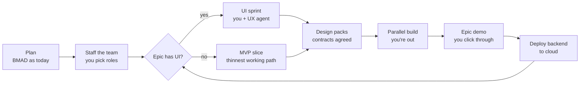
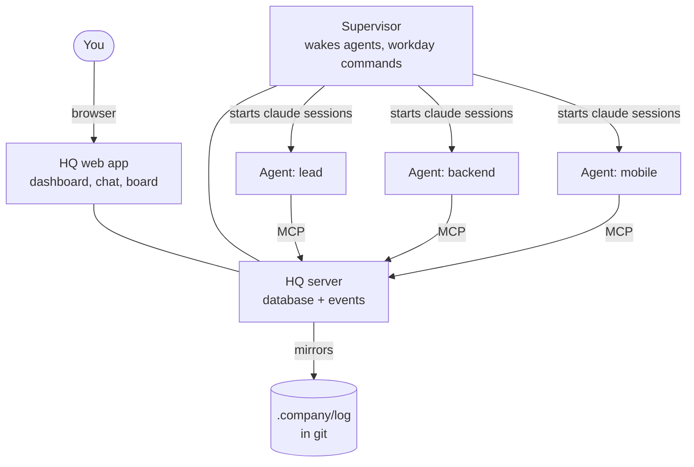

# BMAD Company: Spec

**Status:** Draft v0.1, agreed in chat on 2026-09-24. Nothing is built yet.
**How to read IDs:** every ID in this file is a link. Click it to jump to its definition. New IDs are added at the end of their section; existing IDs are never renumbered.

## TL;DR

- Keep BMAD for planning. Replace its story-by-story build loop with a team of AI agents working in parallel.
- You're involved in three places: UI/UX sessions, escalations the team can't resolve, and the end-of-epic demo.
- Everything the team does is visible in **HQ**, a local app combining Teams-style chat, a Jira-style board, a decisions log and a dashboard.
- Every reference (requirement, ticket, decision, file) is a clickable link.
- It runs on your machine and your Claude plan, during a workday you start and end.

## 1. Problems this solves

| BMAD Phase 4 today | Fix in this spec |
|---|---|
| Create → dev → review loop per story, gated by you; about 2 weeks per epic | Parallel team; you're not in the per-story loop ([TKT-1](#tkt-1)) |
| Nothing to see until late; course-correct after weeks | UI first, continuous preview ([VIS-1](#vis-1)) |
| Long walls of text to read | Dashboard and one-line, multiple-choice escalations ([HQ-1](#hq-1), [ESC-4](#esc-4)) |
| The same questions asked again | A register of your answers that agents check before asking ([ESC-3](#esc-3)) |
| References like "FR-12" that you can't click | Every reference is a link ([REF-1](#ref-1)) |
| Blocked work wastes usage while waiting | Park and resume ([TKT-3](#tkt-3)) |

## 2. Decisions already made

| ID | Decision |
|---|---|
| <a id="d1"></a>D1 | Claude Code runs the team. HQ is reachable over MCP and plain files, so Codex agents can join. |
| <a id="d2"></a>D2 | The app stack is chosen per project during planning. Shortlist: Next.js, Expo / React Native, Postgres; hosting on Vercel, Azure or AWS. |
| <a id="d3"></a>D3 | Runs on your machine, with a workday you start and end ([§11](#11-workday-and-usage-limits)). |
| <a id="d4"></a>D4 | Escalations reach you only in HQ. No phone, Slack or Teams pings. |
| <a id="d5"></a>D5 | Uses your Claude plan login, not an API key. |
| <a id="d6"></a>D6 | Each agent has a role plus domain expertise defined per app. They mostly stay in their domain but aren't locked to a single skill. |
| <a id="d7"></a>D7 | The board is built into HQ, not synced to Jira or GitHub Issues. |
| <a id="d8"></a>D8 | Agents are persistent in the style of OpenClaw, minus its public skill marketplace and public exposure. |
| <a id="d9"></a>D9 | BMAD stays for planning. This replaces BMAD's Phase 4 (implementation). |

## 3. How a project runs



| Step | Who | You involved? | Output |
|---|---|---|---|
| Plan | BMAD agents (analyst, PM, architect, UX) | Yes, as in BMAD today | PRD, architecture and epics, with linkable IDs |
| Staff | Lead + you | Yes: pick the roster | `team.yaml` and an identity file per agent |
| UI sprint (per epic) | UX + frontend + you | Yes: your main session | Clickable prototype with fake data |
| MVP slice (epics without UI) | Team | Review the result | A working thin path, shown in an API explorer or a CLI run |
| Design packs | Developers | No | Sketches, contracts and schema: draft → agreed → frozen |
| Build | Whole team, in parallel | Only for escalations | Merged tickets and previews |
| Epic demo | You | Yes | Go, or a change list |
| Deploy | Devops agent | Approve | Backend running in the cloud, app pointed at it |

| ID | Requirement |
|---|---|
| <a id="flow-1"></a>FLOW-1 | Planning uses BMAD's own workflows. Their outputs get anchored IDs ([REF-5](#ref-5)). |
| <a id="flow-2"></a>FLOW-2 | For an epic with UI, no build ticket that depends on the screens starts before UI sign-off. Groundwork that doesn't depend on screens (schema, auth scaffolding) may start earlier. |
| <a id="flow-3"></a>FLOW-3 | UI sign-off freezes the epic's screens and produces the API contract those screens need. |
| <a id="flow-4"></a>FLOW-4 | An epic without UI starts with an MVP slice. The team revises from your feedback. |
| <a id="flow-5"></a>FLOW-5 | An epic isn't done until you've clicked through its demo. |
| <a id="flow-6"></a>FLOW-6 | After you approve the demo, one command deploys the backend to the chosen cloud ([D2](#d2)) and switches the app's API URL to it. |

## 4. Team and agents

Example roster (`.company/team.yaml`):

```yaml
max_parallel: 3            # agents working at the same time
team:
  - id: lead
    role: Tech lead / PM
  - id: maya
    role: UX designer
    domain: [design system, navigation, onboarding flows]
  - id: arjun
    role: Backend developer
    domain: [Node API, payments]
    also: [Postgres]
  - id: lena
    role: Mobile developer
    domain: [Expo screens, offline sync]
  - id: qa
    role: QA engineer
    domain: [E2E tests, screenshots]
```

| ID | Requirement |
|---|---|
| <a id="team-1"></a>TEAM-1 | You choose how many agents there are and their roles, in `.company/team.yaml`. |
| <a id="team-2"></a>TEAM-2 | Each agent has an identity file with its name, role, domain expertise (main and secondary), rules and allowed tools. |
| <a id="team-3"></a>TEAM-3 | Each agent has two memories: `work.md` (what it built, what it knows, areas it owns) and `comms.md` (open threads, promises made, questions waiting on others). |
| <a id="team-4"></a>TEAM-4 | When a memory grows past a limit, it's compacted into a summary. Older detail moves to an archive the agent can search. |
| <a id="team-5"></a>TEAM-5 | Tickets go to the best domain match. Agents mostly stay in their domain, and before changing another agent's area they check with its owner in HQ. |
| <a id="team-6"></a>TEAM-6 | Work spanning domains is split into linked tickets. The agents collaborate through a shared thread and a contract, rather than one agent editing across domains. |
| <a id="team-7"></a>TEAM-7 | Before coding, a developer publishes a design pack in `docs/design/<area>/`: module/class sketch and logic flow (Mermaid), API contract (OpenAPI), DB schema and key decisions. Any agent can read it. |
| <a id="team-8"></a>TEAM-8 | Each design doc has an owner and a status: draft → agreed → frozen. It becomes "agreed" once every agent that uses it approves. Changing an agreed doc opens a thread tagging all of them. |
| <a id="team-9"></a>TEAM-9 | Each agent works in its own git worktree and branch. The lead merges. |

## 5. Tickets, blocking and resume

Statuses: `To do → In progress → In review → Done`, with `Blocked` entered from and returned to `In progress`.

| ID | Requirement |
|---|---|
| <a id="tkt-1"></a>TKT-1 | The lead turns each epic into tickets with dependencies. Agents work on ready tickets in parallel. |
| <a id="tkt-2"></a>TKT-2 | A ticket isn't started until the tickets it depends on are Done. |
| <a id="tkt-3"></a>TKT-3 | An agent that hits a blocker mid-task doesn't wait, because Claude's prompt cache expires after about 5 minutes. Instead it marks the ticket *Blocked by X* and commits its work in progress. It writes a checkpoint on the ticket: what's done, the exact next step, files touched and open questions. Then it takes another ready ticket in its domain, or stops. |
| <a id="tkt-4"></a>TKT-4 | When the blocking ticket is Done, HQ wakes the same agent with the parked ticket, its checkpoint and the other agent's handoff note. A busy agent finishes its current ticket first; the lead may reassign an urgent one. |
| <a id="tkt-5"></a>TKT-5 | A resumed ticket starts a fresh session from the checkpoint, not from the old conversation. |
| <a id="tkt-6"></a>TKT-6 | Every status change and work update is logged with agent, time and links, so you can see which agent did what, as in Jira. |

## 6. HQ: the team's app

A local web app running on your machine. Its screens: **Dashboard, Chat, Board, Decisions, Inbox, Team, Preview.**

Dashboard sketch:

```
HQ · Dashboard                           Workday: ON   [End day] [Stop now]
──────────────────────────────────────────────────────────────────────────
Needs you: 2      Epic 2 Checkout  ████████░░ 16/20 tickets   Phase: Build
──────────────────────────────────────────────────────────────────────────
TEAM
● lead    working   APP-51  Merge auth branch                    2 min ago
● arjun   working   APP-47  Payment intent API                   5 min ago
◐ lena    blocked   APP-48  Checkout screen (waiting on APP-47) 12 min ago
○ maya    idle      –                                            1 h ago
──────────────────────────────────────────────────────────────────────────
BLOCKED            LATEST PREVIEWS          RECENT DECISIONS
APP-48 ← APP-47    [shot] [shot] [shot]     DEC-7  Stripe Payment Intents
                   Open live app ↗          DEC-6  Soft-delete for orders
──────────────────────────────────────────────────────────────────────────
TODAY  9 tickets moved · 23 commits · tests passing · plan usage 61%
```

| ID | Requirement |
|---|---|
| <a id="hq-1"></a>HQ-1 | **Dashboard** (home screen), updating live. It shows the workday state with Start day / End day / Stop now; each agent's status (working, blocked, idle or off), current ticket and last update; progress and current step for each epic; how many items need you, and the top ones; what's blocked on what; the latest screenshots and a link to the running app; recent decisions; and today's totals (tickets moved, commits, test status, plan usage). |
| <a id="hq-2"></a>HQ-2 | **Chat:** channels (#general, one per epic, #contracts), direct messages, one thread per ticket and @mentions. You can post, and you can message any agent directly (the lead gets a copy). |
| <a id="hq-3"></a>HQ-3 | **Board** (Jira-style): tickets with ID (e.g. APP-42), epic, assignee, blocked-by / blocks and status. Each ticket has an activity log (status changes, comments, checkpoints, commits, screenshots). A per-agent view shows what each agent did today, what it's doing now and what it's waiting on. Commits that mention a ticket ID attach to it automatically. |
| <a id="hq-4"></a>HQ-4 | **Decisions:** every decision made without you, with who, what, why, alternatives considered and links. |
| <a id="hq-5"></a>HQ-5 | **Inbox:** only escalations for you ([ESC-4](#esc-4)), answered with a click. |
| <a id="hq-6"></a>HQ-6 | **Team:** the roster, each agent's identity and both of its memories, readable. |
| <a id="hq-7"></a>HQ-7 | **Preview:** screenshots per ticket and epic, plus a link to the running dev app. |
| <a id="hq-8"></a>HQ-8 | Messages, tickets and decisions are stored in HQ's database and mirrored as readable files under `.company/log/`. History survives when HQ is off and is versioned with the code. |
| <a id="hq-9"></a>HQ-9 | Agents use HQ through an MCP server with tools to post, read, claim and update tickets, checkpoint, log decisions and escalate. It works in both Claude Code and Codex ([D1](#d1)). |

## 7. Clickable references

| ID | Requirement |
|---|---|
| <a id="ref-1"></a>REF-1 | Every item that can be referred to has a stable ID pointing at a file and an anchor: requirements (FR-12, NFR-3), epics, stories, tickets (APP-42), decisions (DEC-7), design docs, doc sections, commits, and files with line numbers. |
| <a id="ref-2"></a>REF-2 | IDs are never reused or renumbered. A registry (`.company/ids.json`) maps each ID to its file, anchor and title. A script keeps it up to date. |
| <a id="ref-3"></a>REF-3 | In HQ, any ID or file path in any text becomes a link. Hovering shows the title and first lines; clicking opens the rendered file at the exact spot. |
| <a id="ref-4"></a>REF-4 | In markdown written by agents, references must be links, e.g. `[FR-12](docs/prd.md#fr-12)`. A check rejects bare IDs ([QA-1](#qa-1)). |
| <a id="ref-5"></a>REF-5 | BMAD planning docs (PRD, architecture, epics) get an anchor on every requirement and section, added in a step right after planning. |
| <a id="ref-6"></a>REF-6 | Escalations, decisions and checkpoints always link their sources, so you never have to go hunting through documents. |

## 8. Escalation and decisions

| ID | Requirement |
|---|---|
| <a id="esc-1"></a>ESC-1 | Escalation ladder: agent → owner of the dependency → tech lead → PM → you. |
| <a id="esc-2"></a>ESC-2 | Before passing a question up, each level checks the facts register, decisions log, contracts and PRD. A question reaches you only if it's still unresolved, or if it's your call: UX or product changes, money, credentials and sign-ups, security, irreversible actions, or departing from the architecture. |
| <a id="esc-3"></a>ESC-3 | Your answers are saved in the facts register (`.company/facts.md`). Agents must check it before asking, so no question is asked twice. |
| <a id="esc-4"></a>ESC-4 | The PM batches escalations to you. Each is one line, multiple-choice, with a recommended option and links to its sources ([REF-6](#ref-6)). |
| <a id="esc-5"></a>ESC-5 | Every autonomous decision is logged ([HQ-4](#hq-4)). |

## 9. Seeing the app as it's built

| ID | Requirement |
|---|---|
| <a id="vis-1"></a>VIS-1 | UI first: screens exist, with fake data, before the logic behind them. |
| <a id="vis-2"></a>VIS-2 | Web: the dev server runs locally, and QA takes Playwright screenshots after each merged ticket. |
| <a id="vis-3"></a>VIS-3 | Mobile: Expo web preview in the browser, Expo Go on your phone, and the iOS Simulator or Android emulator on your machine. |
| <a id="vis-4"></a>VIS-4 | Screenshots are compared with the approved UI, and differences are flagged on the ticket. |
| <a id="vis-5"></a>VIS-5 | Products without a UI demo the MVP slice through an API explorer (Swagger) or a CLI run. |

## 10. Integrations and deployment

| ID | Requirement |
|---|---|
| <a id="int-1"></a>INT-1 | Each third-party service sits behind an adapter with a `mock` and a `live` version, switched per service in `.env`. |
| <a id="int-2"></a>INT-2 | `.company/credentials-needed.md` lists each service you need to sign up for, the key it needs and the tickets that use it. Services stay mocked until MVP. |
| <a id="int-3"></a>INT-3 | After an epic demo, the backend and Postgres deploy to the project's cloud ([D2](#d2)), the web frontend deploys to Vercel if that was chosen, and the mobile app points at the cloud API. |

## 11. Workday and usage limits

| ID | Requirement |
|---|---|
| <a id="day-1"></a>DAY-1 | **End day:** each agent finishes its current step, commits its work in progress and writes a handoff note (done / in progress / next / waiting on). The note goes into its memory and onto its tickets, and is posted in HQ. Then the agent stops. |
| <a id="day-2"></a>DAY-2 | **Start day:** each agent reloads its identity, memory, handoff note and unread messages, posts a one-line stand-up and carries on. |
| <a id="day-3"></a>DAY-3 | **Stop now:** halts all agents immediately. They resume from their last checkpoint. |
| <a id="day-4"></a>DAY-4 | Agents run as normal `claude` sessions on your plan login ([D5](#d5)); bare mode and the Agent SDK need an API key, so they aren't used. All agents share your plan's usage limits, so `max_parallel` caps how many work at once. When a limit is hit, agents pause the same way as End day and resume when it resets. |
| <a id="day-5"></a>DAY-5 | Agents are woken by events: an @mention, a ticket unblocked, a contract changed, or the start of day. A background check by the supervisor catches missed events; it's plain code, so it uses no Claude usage unless there's work. |

## 12. Quality gates

| ID | Requirement |
|---|---|
| <a id="qa-1"></a>QA-1 | A ticket can't move to Done unless typecheck, lint and tests pass; it has a work-log entry; it contains no bare references ([REF-4](#ref-4)); UI tickets have screenshots attached; and a reviewer agent has approved it. |
| <a id="qa-2"></a>QA-2 | Each ticket's diff is reviewed by an agent other than its author. |
| <a id="qa-3"></a>QA-3 | You are the final gate only at the epic demo ([FLOW-5](#flow-5)). |

## 13. Security

| ID | Requirement |
|---|---|
| <a id="sec-1"></a>SEC-1 | HQ listens only on localhost. |
| <a id="sec-2"></a>SEC-2 | No third-party skill or plugin marketplace. Each agent gets only the tools its role needs. |
| <a id="sec-3"></a>SEC-3 | Secrets live in `.env` (gitignored) and never appear in messages, tickets or logs. |
| <a id="sec-4"></a>SEC-4 | Content from outside sources (web pages, fetched docs) is treated as data, never as instructions. |

## 14. Proposed build (not started)



This repo holds the framework, which gets installed into each app project.

In an app project:

```
.company/
  team.yaml                 # roster                      TEAM-1
  agents/<id>/identity.md   # role, domain, rules         TEAM-2
  agents/<id>/work.md       # work memory                 TEAM-3
  agents/<id>/comms.md      # comms memory                TEAM-3
  facts.md                  # your answers                ESC-3
  ids.json                  # reference registry          REF-2
  log/                      # mirrored chat, tickets      HQ-8
  credentials-needed.md     #                             INT-2
docs/
  prd.md, architecture.md, epics/   # from BMAD, anchored REF-5
  design/<area>/                    # design packs        TEAM-7
```

In this repo:

```
hq/            # HQ server, web app, MCP server
supervisor/    # wakes agents, workday commands, max_parallel
templates/     # role identities, team.yaml, CLAUDE.md / AGENTS.md
bmad-bridge/   # adds anchors to BMAD docs, imports epics as tickets
```

**v0 scope**
1. Templates: `team.yaml`, identity files for common roles, and the two memory files.
2. HQ server and MCP tools: chat, tickets, checkpoints, decisions, escalations.
3. HQ web app: dashboard, chat, board, inbox, and reference linking.
4. Supervisor: wakes agents on events, handles workday commands, enforces `max_parallel`.
5. BMAD bridge: anchors on PRD and epics, and epics imported as tickets.
6. One small sample epic run from start to finish on a demo app.

**Later:** screenshot comparison, reviewer gates, Codex as a worker, deploy scripts per cloud.

## 15. Known limits

- An agent's memory is files it re-reads at startup, not real recall. How well it remembers depends on compaction ([TEAM-4](#team-4)).
- Parallel work still produces merge conflicts, which the lead resolves.
- Autonomous work isn't automatically correct. The gates reduce rework but don't eliminate it.
- The iOS Simulator needs a Mac.
- Your plan's usage limits cap how much can run in parallel.
- Claude Code's built-in agent-teams feature is still experimental, so this design doesn't depend on it.
